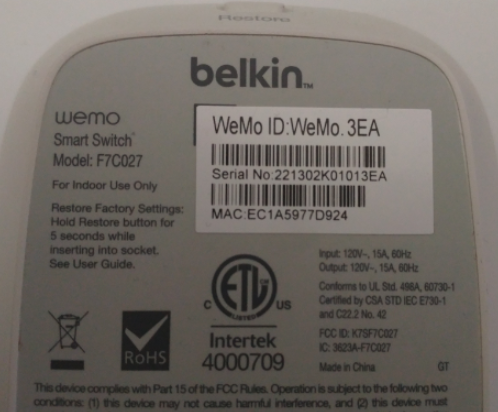

# OCR Image Scan
The purpose of this project is to demo code implementation. 
Code will, hopefully, give context to:
- Problem solving
- Variation on implementation approach
- Understanding of framework usage

## Description
WHAT DOES THE APPLICATION DO?
This project is the Angular interface for reading text from image via [OCR](https://www.ibm.com/cloud/blog/optical-character-recognition), [server side](https://github.com/badbamboo/clg-prototype), framework [Tesseract.js](https://tesseract.projectnaptha.com/). 

> Functionality: 

- Upload an image of a device's MAC ID & Serial Number via REST API 
- Return image text information

