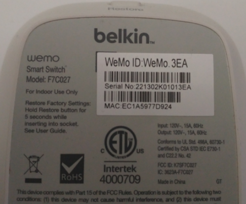

# OCR Image Scan Demo: React UI
> This project is the React interface for OCR Prototype demo API. 
## Description
WHAT DOES THE APPLICATION DO?

- Allow user to upload an image of a device's MAC ID & Serial Number. 
- Return image text information



WHAT IS THE GOAL?

1. Demonstrate the implementation image upload via React UI
1. Demonstrate the implementation unit testing
1. Demonstrate the implementation of REST API 
1. Demonstrate the implementation usage of Makefile

<!-- ## Getting Started
> Running locally in Docker
```
$ git clone <repo>
$ cd <repo>
```
> Running locally as developer
```
$ git clone <repo>
$ cd <repo>
$ make app-init
$ make app-build
$ make app-serve
```

> NOTE: Steps can be manually done by copying commands located in [Makefile](./Makefile) -->

## Documentation
Running documentation command will init the web server.
```
$ make app-documentation
```
> Add test coverage documentation by running the command below.
```
$ make app-test
```
